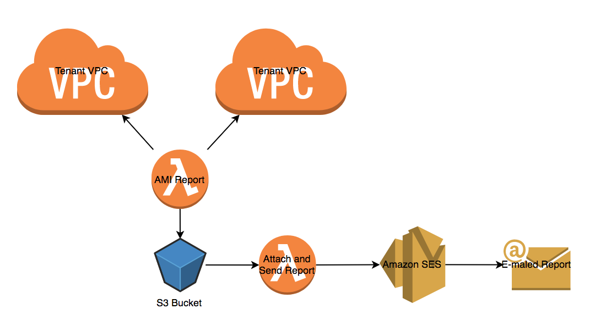

# BSP Mode1 Reporting 

AMI report using Lambda functions and Amazon SES

There are two Lambda functions.  One does a DescribeImages query for each tenant
account, formats the data into CSV and saves the CSV to an S3 bucket.  The
second Lambda function creates a multi-part MIME Email, attaches the report
from the S3 bucket and sends it via Amazon Simple Email Service (SES) to a list
of recipients.

## IAM Roles and Policies ##

### Tenant Account Role ###

Cross-account permissions are required for the Lambda function in the
"management" account to query the "tenant" accounts.  This is done by creating
an IAM role with delegation to the management account.  See the [Terraform
configuration](tenants/iam.tf#L3) for details.

### Tenant Account Policy ###

Attached to the tenant IAM role is a single policy with `ec2:DescribeImages`
action allowed.

### AMI Report Lambda Function IAM Policy ###

The Lambda function which creates the AMI Report is assinged an IAM role in the
management account with a single policy attached that allows it to perform all
of its necessary functions.

####  ec2:DescribeImages ####

Allows the Lambda function to query the Images in the management account.

#### s3:PutObject ####

Allows the Lambda function to write the CSV report to an S3 bucket

#### sts:AssumeRole ####

Allows the Lambda function to assume the delegated tenant IAM role and query
`DescribeImages` in the tenant accounts.

#### kms:Encrypt ####

Allows the Lambda function to encrypt the CSV report it saves to the S3 bucket.

#### logs:CreateLogGroup, etc. ####

`logs:CreateLogGroup`, `logs:CreateLogStream` and `logs:PutLogEvents` actions
are required by all Lambda functions to log their actions.

### Report Emailing Lambda Function IAM Policy ###

The Lambda function which Emails the AMI Report is assinged an IAM role in the
management account with a single policy attached that allows it to perform all
of its necessary functions.

#### ses:SendRawEmail ####

Allows Lambda function to send Email via Amazon SES.

#### s3:GetObject ####

Allows Lambda function to read the report from an Amazon S3 bucket.

#### kms:Decrypt ####

Allows the Lambda function to decrypt the CSV report.

#### logs:CreateLogGroup, etc. ####

`logs:CreateLogGroup`, `logs:CreateLogStream` and `logs:PutLogEvents` actions
are required by all Lambda functions to log their actions.

## Terraform Variables ##

- Copy the `terraform.tfvars.example` file to `terraform.tfvars`
- Set the `mgmt_account` variable to the account number of the account where the
AMI reporting Lambda function will run.  For instructions on how to find the
AWS account number, see the [AWS docs here](https://docs.aws.amazon.com/IAM/latest/UserGuide/console_account-alias.html).
- The `mgmt_account_alias` is the name which will appear in the 'Tenant' column
of the AMI report for the AMIs in the management account.
- Set the `tenant_accounts` to a comma separated list of the AWS account numbers
for the tenant accounts you wish to query for the AMI report.
- Set the `tenant_names` to a comma separated list of the tenant names you want
to appear in the first column of the report to identify the tenant account. The
names must be in the exact same order as the corresponding account number in
`tenant_accounts` variable.
- Set the `sender` to the Email address you want to use as the sender address.
Note: This address must be [verified](https://docs.aws.amazon.com/ses/latest/DeveloperGuide/verify-email-addresses.html) for use by SES.
- Set the `recipients` to a comma separated list of the Email addresses you wish
to receive the report.  Note: These addresses must be [verified](https://docs.aws.amazon.com/ses/latest/DeveloperGuide/verify-email-addresses.html) for use by SES.

### Tenants ###

In the `tenants` sub-directory, there is a terraform file to configure the
cross-account IAM role and policy.  To configure this:

- Copy the `tenants/terraform.tfvars.example` file to `tenants/terraform.tfvars`
- Set the `mgmt_account` variable to the account number of the account where the
AMI reporting Lambda function will run.  For instructions on how to find the
AWS account number, see the [AWS docs here](https://docs.aws.amazon.com/IAM/latest/UserGuide/console_account-alias.html).

For each tenant account, you will need to configure your `AWS_PROFILE`
environment variable and perform a terraform apply for each account.  You will
need AWS credentials for each account with administrator privileges to apply
the Terraform configuration.

## TODO ##

- Add tests for CircleCI/fix configuration
    - Add pylint to CircleCI tests
    - Fix pylint issues
    - Add [TFLint](https://github.com/wata727/tflint) to CircleCI tests
    - Fix TFLint issues
- Schedule lambda to generate reports every night
- Handle AMIs with multiple snapshots
